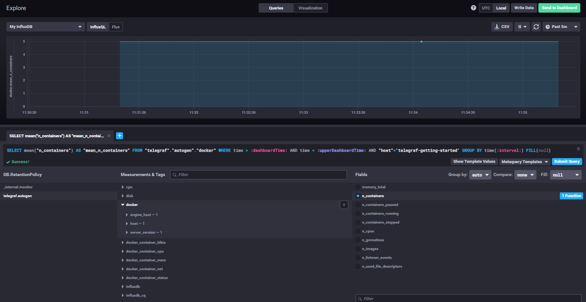

# 10-02-monitoring-system

# 1 Плюcы и минусы Push and Pull

Push Плюсы
1. Простая репликация на несколько серверов 
2. Гибкая настройка объёма и частоты отправки на каждом клиенте
3. Использование менее затратного UDP
4. Удобно при динамической инфраструктуре: агенты сами начинают слать данные при создании

Push Минусы
1. Каждый агент нужно настраивать отдельно
2. Сервер может быть недоступен продолжительное время из-за чего может произойти потеря данных
3. При UDP могут теряться данные
4. Нужна дополнительная проверка подлинности агентов (IP,сертификаты, логин/пароль и пр.)

Pull Плюсы
1. Контроль данных: собираем только со своих агентов
2. Возможность проксирования (выгрузка из закрытых сетей, снижение нагрузки на сервер)
3. Можно собирать данные по HTTP стронним ПО или скриптами
4. Единая точка контроля количества собираемых данных и частоты опроса 

Pull минусы
1. При простое/недоступности сервера не собираем данные
2. Агенты должны верифицировать сборщик данных
3. При большом количестве опрашиваемых агентов необходимо переводить порос на прокси-серверы

# 2 Определить тип системы мониторинга

- Prometheus: Push and Pull
- TICK: Push and Pull
- Zabbix: Push and Pull
- VictoriaMetrics: Push and Pull (По-умолчанию push в редакции Percona)
- Nagios: PULL

# 3 Установка TICK

# 4 Метрика Disk Used

# 5 Метрики Docker

# Со звёздочкой

